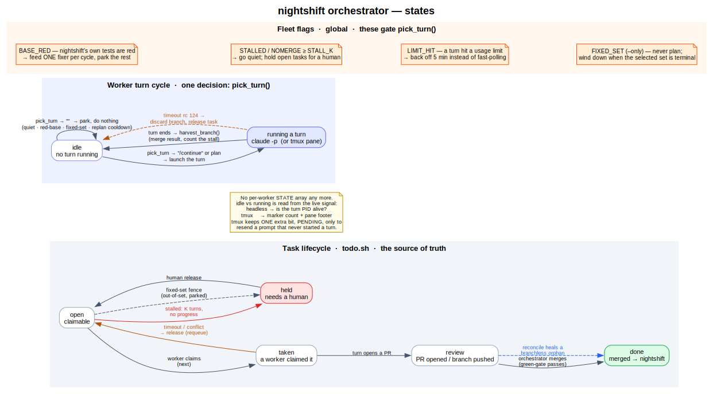

# nightshift orchestrator — states

A map of every state in [`scripts/nightshift-orchestrate.sh`](../scripts/nightshift-orchestrate.sh).
There are three layers, and only the first is a real persisted state machine — the other two are
the orchestrator's in-memory view.



> The diagram is generated from [`nightshift-states.dot`](nightshift-states.dot):
> ```
> dot -Tsvg docs/nightshift-states.dot -o docs/nightshift-states.svg
> ```
> Edit the `.dot` source and re-render — don't hand-edit the SVG.

## 1. Task lifecycle — the source of truth

Persisted by `todo.sh` in the queue (`projects/<project>/todo/*.md`). This is the authoritative
state machine; everything else exists to move tasks through it.

| State | Meaning | Leaves when |
|-------|---------|-------------|
| `open` | claimable | a worker claims it (`next` → `taken`); or it's fenced/stalled → `held` |
| `taken` | a worker has claimed it for a turn | the turn opens a PR (→ `review`); or it times out / conflicts → released to `open` |
| `review` | PR opened / branch pushed, awaiting merge | the orchestrator merges it → `done` |
| `done` | merged into `nightshift` (terminal) | — |
| `held` | needs a human (stalled, or fenced out of a fixed-set run) (terminal-ish) | a human `release`s it → `open` |

`review` is meant to be transient. If a task's work lands in `nightshift` but its status never
advances (and its branch is already pruned), `reconcile()` heals the branchless orphan straight to
`done` — the dashed blue edge.

## 2. Worker turn cycle — one decision

After the simplification there is **no per-worker state array**. A worker is either running a turn
or it isn't, and that's read from a live signal, not stored:

- **headless** (default, `claude -p`): is the turn's PID still alive?
- **tmux** (`--tmux` fallback): the Stop-hook marker count + the pane footer.

Every poll, an idle worker runs through a single function, **`pick_turn()`**, shared by both
backends. It returns the prompt to launch — `"/continue"`, the planning prompt, or `""` (park and
do nothing this poll) — and updates the shared throttles (`BR_ASSIGNED`, `PLANNED_LAST`). When a
turn ends, **`harvest_branch()`** merges its branch and updates the no-merge stall counter.

The tmux backend keeps exactly **one** extra bit, `PENDING`, to detect a prompt that was sent but
never started a turn (so it can resend after a grace window). Headless needs nothing — the PID is
unambiguous.

## 3. Fleet flags — global, gate `pick_turn()`

These are process-wide, not per worker, and short-circuit the decision:

- **`BASE_RED`** — `nightshift`'s own test suite is red → funnel ONE worker to the fix, park the rest.
- **`STALLED` / `NOMERGE ≥ STALL_K`** — K turns with no new merge while open work remains → go quiet, hold the open tasks for a human.
- **`LIMIT_HIT`** — a turn hit a usage limit → back off 5 minutes instead of fast-polling.
- **`FIXED_SET`** (`--only`) — never run a planning turn; wind down once every selected task is terminal.
