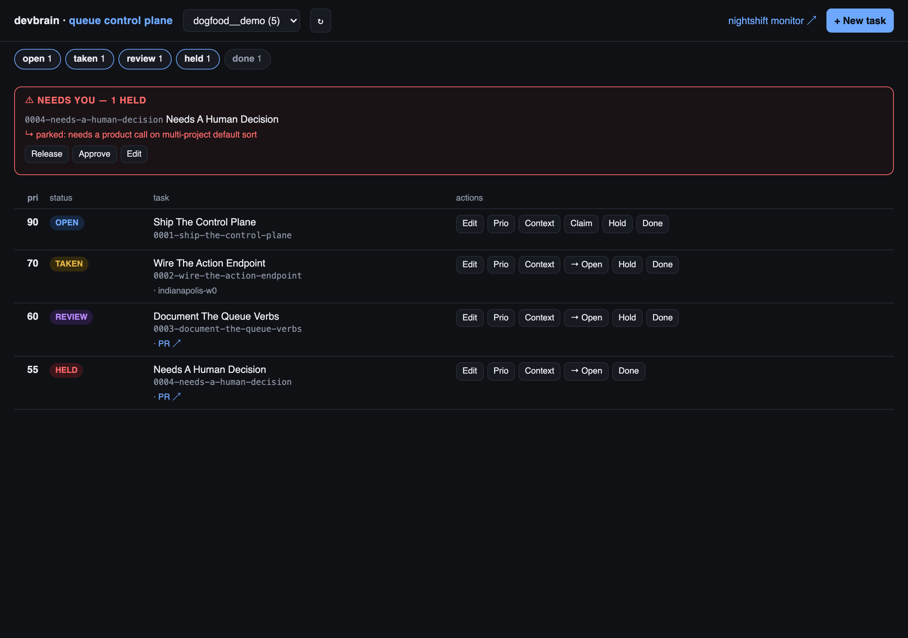
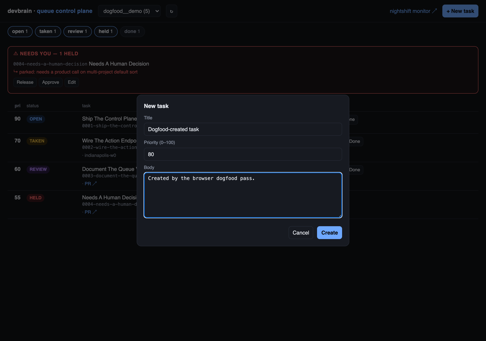
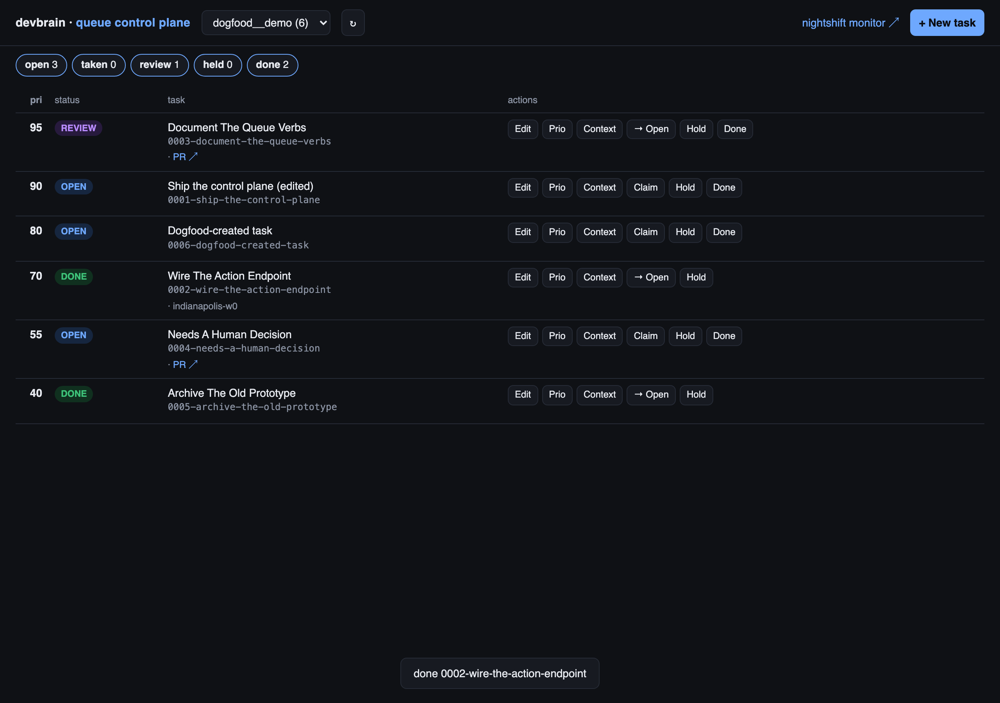

# Queue control plane — browser-driven dogfood

Visual evidence that the queue dashboard (`scripts/queue.py` +
`scripts/queue-dashboard.html`) works end-to-end. Every screenshot below is
produced by `scripts/test-queue-dashboard-dogfood.py`, which drives the **real**
dashboard in a headless Chromium against an isolated, seeded fixture queue (never
your real `~/devbrain-data`) and asserts the visible outcome of each flow — so it
doubles as a UI smoke test.

## Run it

```bash
python3 -m pip install playwright          # once
python3 -m playwright install chromium     # once
python3 scripts/test-queue-dashboard-dogfood.py
# screenshots -> docs/queue-dashboard/screenshots/ ; exits non-zero if any check fails
```

The dogfood pins the CLI under test via `DEVBRAIN_TODO=scripts/todo.sh` (the
`queue.py` server now honors that env var), so it always exercises this checkout's
verbs rather than whatever `devbrain-todo.sh` happens to be installed globally.

## Flows covered

| # | Flow | Screenshots | Asserted |
|---|------|-------------|----------|
| 1 | Overview + **needs-you** held panel | `01-overview` | all 5 status chips render; held task surfaces in the red panel |
| 2 | **Status filter** (toggle to open-only) | `02-filter-open-only` | non-open rows hidden |
| 3 | **Project switch** | `03-project-switch` | other project shows its own tasks |
| 4 | **Create** | `04-create-modal`, `05-create-done` | new task appears in the table |
| 5 | **Edit** | `06-edit-modal`, `07-edit-done` | edited title reflected |
| 6 | **Reprioritize** | `08-prio-modal`, `09-prio-done` | row jumps to the new priority |
| 7 | **Add context** | `10-context-modal`, `11-context-done` | modal closes cleanly |
| 8 | **Hold** | `12-hold-modal`, `13-hold-done` | task moves into the needs-you panel |
| 9 | **Release** (held → open) | `14-release-done` | from the needs-you panel |
| 10 | **Approve** | `15-approve-done` | greenlight a held task |
| 11 | **Done** | `16-done-done` | done status pill + toast |





All 11 checks passed on the latest run (16 screenshots).
